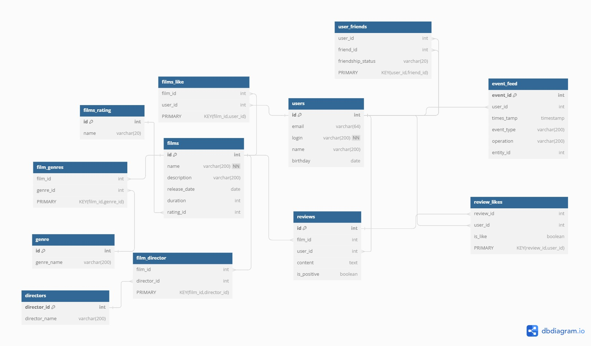

# java-filmorate
Template repository for Filmorate project.


# Схема Базы данных


## Запросы
- Получение всех фильмов:
``SELECT * FROM films;``

- Получение всех пользователей:
``SELECT * FROM films;``

- Получение топ-10 фильмов по лайкам:
```sql
SELECT f.film_id, 
       f.name,
       COUNT(fl.user_id) AS like_count
FROM films f
JOIN films_like fl ON f.film_id = fl.film_id
GROUP BY f.film_id
ORDER BY like_count DESC
LIMIT 10;
```
- Получение общих друзей:
```sql
SELECT uf1.friend_id AS common_friend_id
FROM user_friends AS uf1
JOIN user_friends AS uf2 ON uf1.friend_id = uf2.friend_id
WHERE uf1.user_id = ? AND uf2.user_id = ?
AND uf1.friendship_status = 'confirmed' AND uf2.friendship_status = 'confirmed';
```
