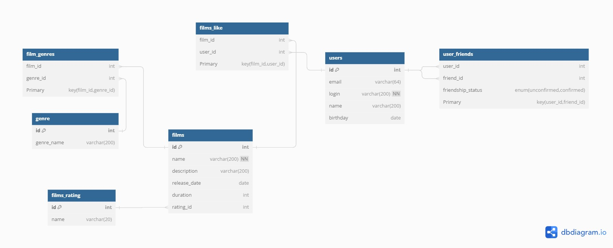

# java-filmorate
Template repository for Filmorate project.


# Схема Базы данных


## Запросы
- Получение всех фильмов:
``SELECT * FROM films;``

- Получение всех пользователей:
``SELECT * FROM users;``

- Получение топ-10 фильмов по лайкам:
```sql
SELECT f.id, f.name, f.description, f.release_date, f.duration, COUNT(fl.user_id) AS likes_count
FROM films f
LEFT JOIN films_like fl ON f.id = fl.film_id
GROUP BY f.id
ORDER BY likes_count DESC
LIMIT 10;
```
- Получение общих друзей:
```sql
SELECT uf1.friend_id
FROM user_friends uf1
JOIN user_friends uf2 ON uf1.friend_id = uf2.friend_id
WHERE uf1.user_id = 1 AND uf2.user_id = 2
AND uf1.friendship_status = 'confirmed'
AND uf2.friendship_status = 'confirmed';
```
